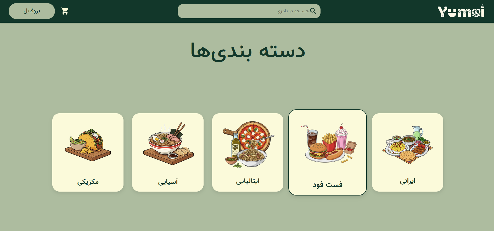
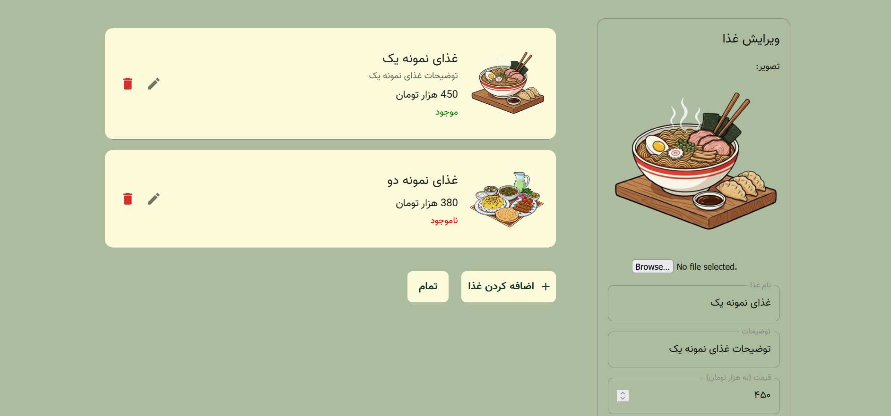

# AI-Based Food Recommendation System — Frontend

|  | Home page of the application |

This repository contains the **Frontend** of an AI-powered food recommendation system inspired by online food delivery platforms such as **Snappfood**.  
The system aims to provide users with a smart, personalized food selection experience by integrating a modern frontend interface with a backend service and an AI-based recommendation engine.

⚠️ **Important:**  
This repository includes **only the frontend** of the system.  
To run the complete project, you must also clone and run the **Backend** and **AI (Recommender Engine)** repositories.

---

## System Description

The AI-Based Food Recommendation System is designed to help users choose food more efficiently by analyzing preferences and generating intelligent recommendations.  
The frontend serves as the main interaction layer where users explore options, apply filters, and view AI-generated food suggestions in an intuitive and user-friendly interface.

The system is built using a **microservice-style architecture** with three separate repositories that work together.

---

## Project Architecture

The complete system consists of three independent repositories:

### 1️⃣ Frontend (This Repository)
- **Repository:** https://github.com/SetarehPishiyar/AI-Software-frontend
- **Technology:** React (Create React App)
- **Responsibility:**
  - User interface  
  - User interaction and visualization  
  - Displaying AI-based recommendations
- - **Deployment:** Dockerized using a Dockerfile

### 2️⃣ Backend
- **Repository:** https://github.com/mehdizhd11/AI-Snappfood
- **Responsibility:**
  - API development  
  - Business logic  
  - Data management  
  - Communication with AI service

### 3️⃣ AI / Recommender Engine
- **Repository:** https://github.com/MobinaShahbazi/Food-Recommender-Engine
- **Responsibility:**
  - Machine learning–based food recommendation  
  - Generating personalized suggestions based on user data

---

## Prerequisites

To run this project, you need:

- Git
- Docker (recommended)
- Node.js & npm (optional, for local development without Docker)

---

## Installation & Setup

### Step 1: Clone All Repositories

It is recommended to clone all three repositories into a single parent directory:

```bash
mkdir ai-food-recommendation
cd ai-food-recommendation

# Frontend
git clone https://github.com/SetarehPishiyar/AI-Software-frontend.git

# Backend
git clone https://github.com/mehdizhd11/AI-Snappfood.git

# AI Engine
git clone https://github.com/MobinaShahbazi/Food-Recommender-Engine.git
```

---

### Step 2: Environment Variables

The frontend communicates with backend and AI services via environment variables.

Example `.env` file:

```env
REACT_APP_API_BASE_URL=http://localhost:8000
REACT_APP_AI_BASE_URL=http://localhost:5000
```

Update these values based on how your backend and AI services are configured.

---

### Step 3: Run Frontend Using Docker

> 🔁 **Reverse Proxy with Nginx**  
In the final deployment setup, the frontend is served behind an **Nginx reverse proxy**.  
Nginx is responsible for:
- Serving the React build files
- Acting as a reverse proxy between the frontend, backend, and AI services
- Handling routing and request forwarding to the appropriate services

This setup improves performance, scalability, and separation of concerns.

If you are using a production-like environment, Nginx should be configured to forward requests based on route prefixes:
- Requests starting with `/api` are proxied to the **Backend service**
- Requests starting with `/model` are proxied to the **AI (Recommender Engine)**

This clear separation of routes allows the frontend to communicate with both services through a single Nginx entry point.

### Step 3: Run Frontend Using Docker

```bash
cd AI-Software-frontend
docker build -t ai-food-frontend .
docker run -p 3000:3000 ai-food-frontend
```

The frontend will be available at:

```
http://localhost:3000
```

⚠️ Make sure that the **Backend** and **AI Engine** are running for full functionality.

---

## Run Frontend Locally (Without Docker)

For development purposes:

```bash
cd AI-Software-frontend
npm install
npm start
```

---

## Frontend Features

### User Interface
- Modern and clean React-based UI
- Responsive design for different screen sizes
- Component-based and modular structure

### Core Functionalities
- User interaction for selecting food preferences
- Displaying AI-generated food recommendations
- Filtering and preference-based recommendation flow
- Integration with backend APIs
- Loading and error handling states

### Recommendation Experience
- Personalized food suggestions based on user input
- Detailed view of recommended food items
- Dynamic updates based on user preferences

### Technical Highlights
- Scalable React project structure
- Environment-based API configuration
- Dockerized frontend for easy deployment

---

## Demo Screenshots

All demo images are available in the `Demo` folder of this repository.

| Screenshot | Description |
|----------|-------------|
|  | Home page of the application |
|  | User preferences and filtering |
|  | Home page of the application |
|  | AI-generated food recommendations |
|  | Detailes and contact us |
|  | Restaurant page for user |
|  | Track order page for user |
|  | Profile page for user |
|  | Edit Menu page for Restaurant |

> See Other pages in the `Demo` Folder.

---

## Project Structure

```
AI-Software-frontend/
│── public/
│── src/
│── demo/
│── Dockerfile
│── package.json
│── README.md
```

---

## Contribution

Contributions are welcome.  
Feel free to open an issue or submit a pull request for improvements or bug fixes.
